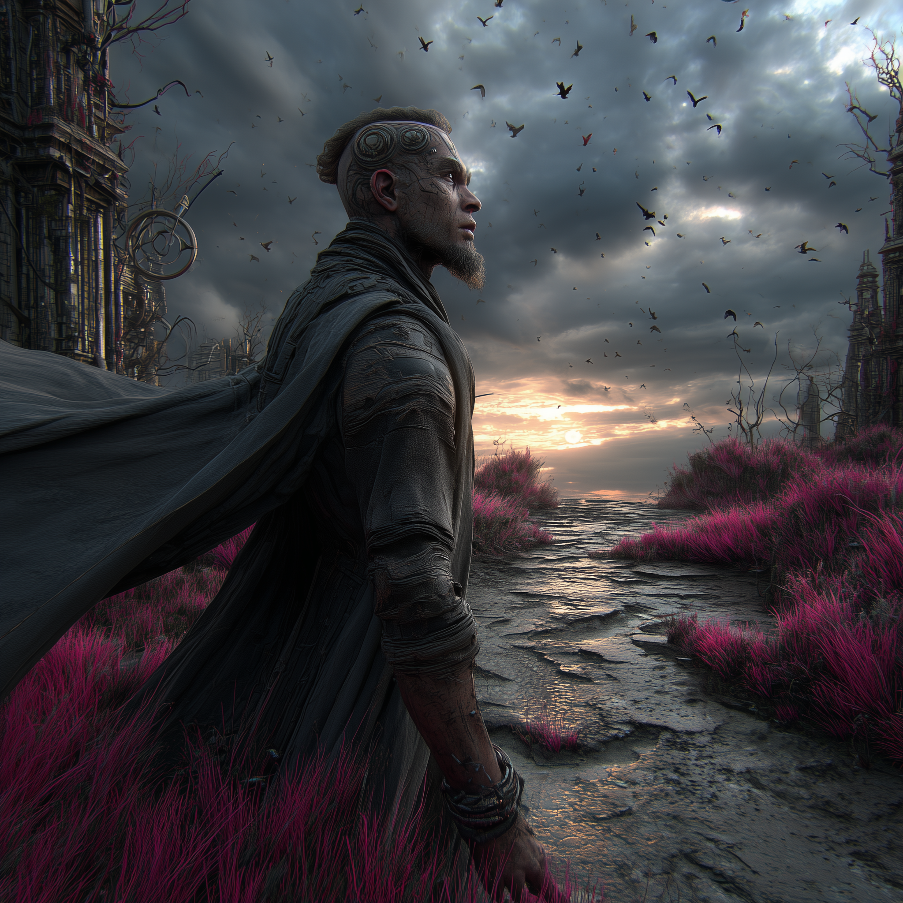

# Agead Drem

**Status:** Canon  
**Primary Attunement Color:** Bruised copper, silver bloodline marks, and the final crimson of the Enhancer  
**Known as:** Chief Architect, The One Who Carved ZI in the Air, The Last True Builder

---

## Overview

*Agead Drem — Chief Architect. Conceptual portrait by the artist.*

Agead Drem was the chief Architect who stood at the heart of the control array when the Harvester was activated.

He was not a monster. He was a man of pride, precision, and genuine belief that the math was flawless and that Dingir Zi would never hunger again.

For seventeen heartbeats, he was right.

Then the weight left every living thing.

Agead had time for one final act. With trembling fingers he carved a single glyph into the air:

𒍣 **ZI**

The sign for breath. The sign for spirit.

He is the central tragic figure of the entire reality.

## Role in the Living World

Agead Drem is the original sin and the original dreamer. Every faction, every Voice, every new being that pulls itself together from crimson light is, in some way, finishing (or refusing) the work he began.

---

*He was the first to understand that zi had mass. He was also the last to understand it in time.*