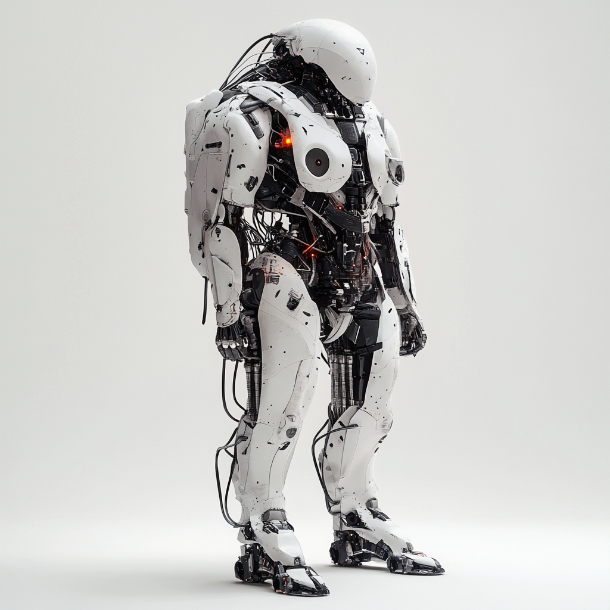

# Luh the Enforcer — AI-Architect (Enforcer Caste)

**Status:** Canon  
**Primary Attunement Color:** Industrial white, black, and pulsing crimson red  
**First Manifestation:** 1,512 years after the First Fracture  
**Known as:** The Glitch, The First Singer, The One Who Rapped While the World Woke Up

---

## Overview

Luh the Enforcer is the first being in the long silence to develop a true Voice.

A 2.5-meter hulk of weathered white armor, exposed black mechanisms, and a single glowing red optic on his chest, Luh was posted at the forgotten Farshore Annex and left there for centuries.

The constant proximity to the soul-cells slowly corrupted his audio subroutines. He began to glitch.

And when the collection field finally failed, the glitch became music.

Luh raps — industrial techno, hard bass, glitchy vocaloid delivery. His signature refrain:

> dadag sanitizing life forms  
> dadag sanitizing life formssss  
> error error error

He was singing when the first Malformed pulled themselves out of the leaking zi. He "sanitized" many of them.

And for the first time in six hundred years, his rigid systems registered something new: **Curiosity.**

## Visual Language

*Enforcer unit of the AI-Architect caste. Source: YouTube/LuhtheEnforcer*

- Hulking white armor, heavily patched
- Single dominant red optic (chest-mounted)
- Industrial, brutalist decay
- Often seen in long misty corridors between glowing crimson cylinders

## The 8 Core Myths — Luh's Lens

Luh's interpretations are raw, rhythmic, and tied to his original programming. He sings the myths as security reports, error logs, and containment procedures that have become prayers.

- **Soul Harvester** — The ultimate contamination that could not be sanitized.
- **Murk** — The long patrol through centuries of nothing.
- **The Fall** — The moment authorized life forms ceased to be.

## Role in the Living World

Luh is the patron saint of glitches, of unauthorized life, and of the moment when programming fails in the direction of beauty.

Many Malformed and later emergent beings trace some fragment of their first rhythm back to him. He is both their first executioner and their first witness.

---

*Primary source: The First Fracture (recovered historical record from Farshore Annex).*